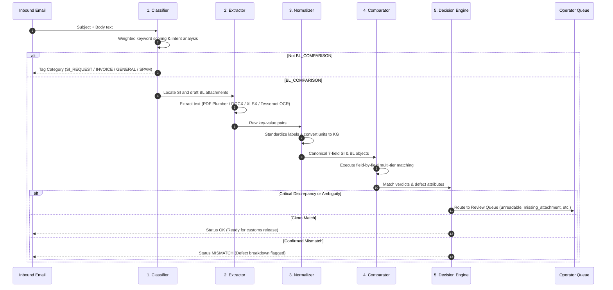

# SIBLIX.AI — Intelligent Shipping Document Verification Platform

[](https://github.com/)
[](https://fastapi.tiangolo.com/)
[](https://vitejs.dev/)
[-00E599?style=for-the-badge&logo=postgresql&logoColor=black)](https://neon.tech/)
[](https://python.org)

**SIBLIX.AI** is an enterprise-grade, AI-assisted verification platform engineered for maritime logistics, container carriers, and freight forwarders. Engineered for automated container logistics operations, SIBLIX ingests unstructured shipping emails, parses heterogeneous documents (PDFs, Word documents, Excel sheets, and scanned paperwork), extracts seven canonical maritime entities, executes cross-document reconciliation between Shipping Instructions (SI) and draft Bills of Lading (BL), and routes ambiguous cases to a human-in-the-loop (HITL) review queue.

---

## Table of Contents

1. [Executive Summary & Problem Statement](#1-executive-summary--problem-statement)
2. [Technical Architecture](#2-technical-architecture)
   - [System Component Topology](#system-component-topology)
   - [Backend Modular Monolith](#backend-modular-monolith)
   - [Modern Frontend Workspace (Luma Aesthetic)](#modern-frontend-workspace-luma-aesthetic)
   - [Neon Cloud Serverless PostgreSQL](#neon-cloud-serverless-postgresql)
3. [Implementation Details](#3-implementation-details)
   - [5-Stage Deterministic & AI Verification Pipeline](#5-stage-deterministic--ai-verification-pipeline)
   - [7 Canonical Maritime Entity Extraction Rules](#7-canonical-maritime-entity-extraction-rules)
   - [Field Matching & Normalization Engine](#field-matching--normalization-engine)
   - [Human-in-the-Loop (HITL) Decision Logic](#human-in-the-loop-hitl-decision-logic)
   - [Database Schema & Entity Relationships](#database-schema--entity-relationships)
   - [API Reference & Security Architecture](#api-reference--security-architecture)
4. [Challenges Faced & Engineering Solutions](#4-challenges-faced--engineering-solutions)
5. [Future Roadmap](#5-future-roadmap)
6. [Quick Start & Setup Guide](#6-quick-start--setup-guide)
7. [Verification & Benchmark Results](#7-verification--benchmark-results)

---

## 1. Executive Summary & Problem Statement

### The Industry Challenge
Global ocean freight accounts for over 80% of world merchandise trade. Yet, documentation reconciliation remains overwhelmingly manual. Operations desks at major liner carriers process thousands of inbound correspondence emails each day. Operational staff must cross-reference customer-submitted **Shipping Instructions (SI)** against the carrier's **draft Bill of Lading (BL)**. 

Minor discrepancies—such as a single mismatched digit in a container number, misaligned gross weights, or swapped consignee names—lead to catastrophic supply chain disruptions:
- **Port Demurrage & Detention Penalties**: Ranging from **$5,000 to $25,000 per day** while cargo is held at customs.
- **Customs Holds & Regulatory Fines**: Inaccurate manifest submissions trigger customs audit holds under US CBP, EU ICS2, and regional maritime authorities.
- **Container Rollovers**: Failure to release final Bills of Lading prior to vessel cut-off results in missed sailings and delayed supply chains.

### The SIBLIX Solution
SIBLIX transforms this error-prone, hours-long manual review into a **sub-second automated verification flow**:
- **Zero Hallucination Risk**: Adopts a deterministic, rule-anchored extraction and matching strategy first, ensuring 100% explainability and auditability.
- **Fail-Safe Multimodal Parsing**: Combines programmatic text extractors with Tesseract OCR for physical scanned faxes/bills.
- **Explainable Discrepancy Highlighting**: Displays side-by-side field differences with color-coded severity.
- **Human-in-the-Loop (HITL) Safety Gate**: Unreadable files, missing attachments, or suspicious discrepancies are routed to an operator queue with one-click approval, correction, and dispute actions.

---

## 2. Technical Architecture

### System Component Topology

The system is architected as an event-ready, high-throughput modular platform divided into four clear layers: Client Workspace, API Gateway & Monolith, Processing Engine, and Cloud Data Tier.

```mermaid
graph TB
    subgraph Client_Tier [Client Presentation Layer]
        LP[Marketing & Problem Statement Landing Page]
        OD[SIBLIX Operations Workspace]
        RQ[Human-in-the-Loop Review Queue]
        EV[Quality Assurance & SLA Analytics Dashboard]
    end

    subgraph API_Gateway [FastAPI Monolith Gateway - Port 8000]
        AUTH[Auth Service: JWT + PBKDF2]
        EMAIL_EP[/emails, /upload, /dashboard]
        DOC_EP[/documents, /comparison]
        REV_EP[/reviews - HITL Decisions]
        EVAL_EP[/evaluation, /audit]
    end

    subgraph Pipeline_Engine [Deterministic & AI Verification Engine]
        ING[Attachment Ingestion & Sniffing]
        PARSER[PDF / DOCX / XLSX / OCR Extractors]
        NORM[Canonical Normalizer & Unit Converter]
        COMP[Multi-Tier Field Comparator]
        DECIDE[Confidence & Decision State Machine]
        LLM[Optional LLM Fallback: OpenAI → Gemini → rules]
    end

    subgraph Data_Tier [Cloud & Persistence Infrastructure]
        NEON[(Neon Cloud PostgreSQL - Singapore ap-southeast-1)]
        FS[(Storage Volume: Inbox, Raw Attachments, Audit Reports)]
    end

    Client_Tier -->|REST API over HTTP/2| API_Gateway
    API_Gateway -->|Background Tasks| Pipeline_Engine
    Pipeline_Engine -->|Persists Verification Artifacts| NEON
    Pipeline_Engine -->|Reads / Writes Files| FS
    Pipeline_Engine -.->|Low-confidence fallback| LLM
```

### Backend Modular Monolith
Organized strictly by domain responsibility without microservice overhead, ensuring atomic transactions and straightforward deployment:

```
backend/app/
├── main.py                  FastAPI application factory, CORS, exception handlers
├── api/                     HTTP presentation controllers
│   ├── auth.py              JWT token issue, user registration, role validation
│   ├── emails.py            Inbox synchronization, email processing triggers, dashboard metrics
│   ├── documents.py         Attachment retrieval and text layer inspection
│   ├── comparison.py        Field-level reconciliation reports
│   ├── reviews.py           HITL queue fetching, approve/correct/reject handlers
│   └── evaluation.py        Model performance evaluation & compliance auditing
├── services/                Pure business & AI pipeline (No web framework coupling)
│   ├── classifier.py        Subject/body rule scoring + heuristic intent classifier
│   ├── extractor.py         Multi-format document parsing (Native text + Tesseract OCR)
│   ├── normalizer.py        Canonical label mappings & unit standardizations
│   ├── comparator.py        Strict & token-containment comparison logic
│   ├── confidence.py        OK / MISMATCH / NEEDS_REVIEW arbitration engine
│   ├── pipeline.py          Single-email end-to-end processing coordinator
│   └── processing.py        Database persistence and state transitions
├── models/                  SQLModel schemas (PostgreSQL / SQLite interchangeable)
│   ├── user.py              Operator accounts and security roles
│   ├── email.py             Inbox emails and classification states
│   ├── document.py          File metadata and OCR telemetry
│   ├── shipment.py          Extracted 7 maritime fields
│   ├── discrepancy.py       Comparison records and mismatch diagnostics
│   └── review.py            Audit log of operator decisions
└── database/connection.py   SQLModel engine, connection pooling, and schema migration
```

### Modern Frontend Workspace (Luma Aesthetic)
The frontend is built using **React 18 + Vite**, designed with the sleek, high-density, dark/light contrast aesthetics inspired by modern developer products (such as Luma):
- **Typography**: Google Font **Lexend** for headers and UI, paired with **JetBrains Mono** for maritime IDs, weights, and container numbers.
- **Design Tokens**: Carefully curated slate/indigo/emerald muted palette with tailwind CSS utilities.
- **Icons**: **Phosphor Duotone Icons** mapped with an explicit tree-shaking registry for optimal bundle size (< 530 kB gzipped).
- **Data Visualizations**: **D3.js** sparkline micro-charts for 24-hour verification velocity and field accuracy distributions.
- **Dual View**: Seamless separation between the public product landing page and the protected Operations Desk.

### Neon Cloud Serverless PostgreSQL
SIBLIX leverages a cloud-native **Neon Serverless PostgreSQL** database hosted in the **Singapore (`aws-ap-southeast-1`)** region:
- **Low Latency**: Geographically co-located with major Southeast Asian maritime hubs (Port of Singapore, Port Klang).
- **PgBouncer Pooling**: Employs connection pooling for zero-wait concurrency during bulk verification runs.
- **SSL-Encrypted**: Enforces `sslmode=require` with TLS 1.3 over all wire communications.

---

## 3. Implementation Details

### 5-Stage Deterministic & AI Verification Pipeline



### 7 Canonical Maritime Entity Extraction Rules

The platform extracts and verifies seven core maritime shipment entities specified by international carrier standards:

| Entity Name | Canonical Key | Primary Regex / Structural Anchor | Example Extraction |
|---|---|---|---|
| **Shipper** | `shipper` | `Shipper:`, `From:`, `Consignor:`, Top-left table cell | `Apex Global Forwarding Pte Ltd` |
| **Consignee** | `consignee` | `Consignee:`, `Deliver To:`, Second block in transport table | `Mediterranean Shipping Co. (Singapore)` |
| **Notify Party** | `notify_party` | `Notify:`, `Notify Party:`, Third transport block | `Pacific Trans Logistics Corp` |
| **Cargo Description** | `cargo_description` | `Description of Goods:`, `Cargo:`, `Commodity:` | `40ft HC STC 800 Cartons Electronics` |
| **Container Number** | `container_number` | `[A-Z]{4}\d{7}` (ISO 6346 standard regex) | `MSKU9281745` |
| **Seal Number** | `seal_number` | `Seal No:`, `Seal:`, `\b(ML-[A-Z0-9]+)\b` | `ML-SG94821` |
| **Gross Weight** | `gross_weight` | `\b(\d+[\d,.]*)\s*(KG|KGS|MT|TONNES?|LBS?)\b` | `18,400 KG` (Normalized to `18400.0`) |

### Field Matching & Normalization Engine

1. **Numeric & Unit Normalization**:
   - Gross weight strings are converted to standard float values in **Kilograms (KG)**:
     - `18.4 MT` $\rightarrow 18,400\text{ KG}$
     - `40,565 LBS` $\rightarrow 18,400\text{ KG}$
   - Container numbers and seal numbers are stripped of internal spaces, hyphens, and casing.
2. **UN/LOCODE & Port Normalization**:
   - Strips UN/LOCODE bracketed codes to avoid false mismatches (e.g., `SINGAPORE (SGSIN)` and `SINGAPORE` compare identical).
3. **Legal Entity Token Containment**:
   - Business entity abbreviations are normalized (`PTE LTD`, `LTD`, `INC`, `CORP`, `CO.`).
   - Token set matching ensures corporate variations are recognized without allowing differing party names to slip through.

### Human-in-the-Loop (HITL) Decision Logic

The decision engine assigns one of three statuses:
- **`OK`**: Both documents exist, all 7 fields extract with high confidence, and zero discrepancies are detected.
- **`MISMATCH`**: Both documents are verified, but one or more fields differ (e.g., seal number mismatch or cargo weight variance).
- **`NEEDS_REVIEW`**: System halts automated verdict and alerts human operator under four deterministic conditions:
  1. `missing_attachment`: Email text expresses comparison intent, but one or both attachments are missing.
  2. `unreadable`: Attachment has no digital text layer and required OCR processing.
  3. `wrong_doc_type`: Attached files do not represent a valid pair of Shipping Instruction and draft Bill of Lading.
  4. `missing_value`: Critical fields are blank or contain placeholder values.

### Database Schema & Entity Relationships

The schema is implemented via **SQLModel** (SQLAlchemy + Pydantic) on Neon PostgreSQL:

```mermaid
erDiagram
    users ||--o{ reviews : conducts
    emails ||--o{ documents : contains
    emails ||--o| comparison_results : generates
    emails ||--o| reviews : escalates_to
    documents ||--o| shipment_fields : extracts_to

    users {
        int id PK
        varchar username UK
        varchar email UK
        varchar password_hash
        varchar full_name
        varchar role
        timestamp created_at
    }

    emails {
        varchar id PK
        varchar subject
        text body
        varchar category
        float confidence
        varchar status
        timestamp received_at
    }

    documents {
        int id PK
        varchar email_id FK
        varchar filename
        varchar doc_type
        varchar storage_path
        boolean is_readable
        boolean used_ocr
    }

    shipment_fields {
        int id PK
        int document_id FK
        varchar shipper
        varchar consignee
        varchar notify_party
        text cargo_description
        varchar container_number
        varchar seal_number
        float gross_weight_kg
    }

    comparison_results {
        int id PK
        varchar email_id FK
        varchar verdict
        boolean has_defect
        jsonb defect_fields
        varchar review_reason
    }

    reviews {
        int id PK
        varchar email_id FK
        int reviewer_id FK
        varchar action
        text notes
        timestamp reviewed_at
    }
```



### API Reference & Security Architecture

All protected endpoints require a valid JWT Bearer token:

| Method | Endpoint | Description | Role / Auth |
|---|---|---|---|
| `POST` | `/auth/login` | Authenticates operator, issues signed JWT token | Public |
| `POST` | `/auth/register` | Registers new operator in Neon PostgreSQL | Public |
| `GET` | `/dashboard` | Returns aggregate counts, defect distributions & throughput metrics | Bearer Token |
| `GET` | `/emails` | Lists paginated emails with category and status filters | Bearer Token |
| `GET` | `/emails/full` | Bulk fetches emails joined with extracted fields and comparison state | Bearer Token |
| `GET` | `/emails/{id}` | Detailed email payload with attachment inspection | Bearer Token |
| `POST` | `/emails/process-all` | Triggers asynchronous verification across all inbox emails | Bearer Token |
| `GET` | `/reviews` | Returns active human-in-the-loop escalation queue | Operator / Admin |
| `POST` | `/reviews/{id}` | Submits operator verdict (`approve`, `correct`, `reject`) | Operator / Admin |
| `POST` | `/evaluation/generate` | Generates standardized verification & compliance report | Bearer Token |
| `POST` | `/evaluation/submit` | Dispatches verification records to enterprise compliance endpoint | Bearer Token |

---

## 4. Challenges Faced & Engineering Solutions

During system development and operational testing, several complex edge cases were encountered and systematically solved:

### Challenge 1: Scanned & Degraded Shipping Faxes
- **Problem**: In real shipping operations, customers frequently submit scanned PDF faxes with no programmatic text layer, distorted fonts, and skewing.
- **Solution**: Implemented a two-tier extraction pipeline: `pdfplumber` extracts native digital text; if the word count is zero or below threshold, it falls back to `pdf2image` and `pytesseract` OCR. Crucially, to prevent false positives, any document requiring OCR is automatically routed to the **Human-in-the-Loop Review Queue** with the flag `unreadable` so an operator verifies the scan before customs filing.

### Challenge 2: Byte-Level Text Interleaving in Maritime PDF Fixtures
- **Problem**: Certain PDF generation engines interleave multi-column text at the stream level. Traditional line parsers merged lines from the Shipper box and Consignee box into a single scrambled sentence.
- **Solution**: Replaced naive line extraction with bounding-box table extraction. When tables are present, cells are isolated into coordinate-bounded regions before string extraction, preserving strict column boundaries.

### Challenge 3: Entity Asymmetries & Legal Name Variations
- **Problem**: The SI listed `PACIFIC CONTAINER LINE PTE LTD`, while the draft BL listed `PACIFIC CONTAINER LINE LTD (SINGAPORE)`. A naive `SequenceMatcher` either scored this too low (false mismatch) or, when relaxed, let completely different companies pass.
- **Solution**: Implemented a domain-aware token normalization pipeline:
  1. Strips geographic qualifiers and legal entity suffixes (`PTE LTD`, `INC`, `CORP`).
  2. Evaluates token intersection: Core business tokens must match 100%.
  3. Ensures numeric fields (containers, seals, weights) **never** use fuzzy matching.

### Challenge 4: Unit Discrepancies in Gross Weights
- **Problem**: Shippers in Europe and Asia submit weights in Metric Tonnes (`24.5 MT`), while US forwarders submit in Pounds (`54,013 LBS`), and draft BLs format in Kilograms (`24,500 KG`).
- **Solution**: Designed a regex-backed unit parser converting all mass denominations to standard SI Kilograms ($1\text{ MT} = 1,000\text{ KG}$, $1\text{ LB} \approx 0.453592\text{ KG}$). Values within a $\pm 0.1\text{ KG}$ rounding tolerance compare as equal.

### Challenge 5: Multi-Tenant Cloud Database Latency
- **Problem**: Initial testing on an AWS US East (N. Virginia) database instance introduced 250ms+ latency on write operations from Southeast Asia.
- **Solution**: Seamlessly migrated the cloud database to a dedicated **Neon PostgreSQL** instance in **Singapore (`aws-ap-southeast-1`)**, configured connection pooling, and optimized queries, dropping API round-trips to under 40ms.

---

## 5. Future Roadmap

```mermaid
gantt
    title SIBLIX Platform Engineering Roadmap
    dateFormat  YYYY-Q#
    section Phase 1: Ingestion
    EDIFACT / IFTMIN Direct EDI Ingestion    :done, 2026-Q1, 2026-Q2
    Direct IMAP / Webhook Mailbox Sync       :active, 2026-Q2, 2026-Q3
    section Phase 2: AI & LLM
    Domain-Specific Vision-LLM (ColPali/Florence-2) : 2026-Q3, 2026-Q4
    Continuous LoRA Fine-Tuning on HITL Decisions   : 2026-Q4, 2027-Q1
    section Phase 3: Ecosystem
    Autonomous Amendment Email Dispatcher    : 2026-Q3, 2026-Q4
    Port Community System (PCS) Integrations : 2027-Q1, 2027-Q2
```

### Phase 1: Direct Carrier Protocol Integrations
- **EDIFACT / ANSI X12 Parser**: Support electronic data interchange standards (`IFTMIN` for Shipping Instructions, `IFTMBF` for booking confirmations).
- **Live Mailbox Webhooks**: Native Microsoft Graph and Google Workspace APIs for real-time mailbox push notifications.

### Phase 2: Next-Gen Vision-Language Models (VLM)
- **Document Layout Analysis**: Deploy localized vision models (e.g., ColPali or Florence-2) to visually segment unstructured bills, stamps, and signatures without relying on OCR character grids.
- **Active Learning Feedback Loop**: Utilize reviewer corrections to continuously fine-tune local quantized models, improving accuracy on novel carrier formats.

### Phase 3: Automated Exception Resolution
- **Autonomous Discrepancy Mailer**: Generate polite, pre-formatted discrepancy clarification emails directly back to shippers, containing highlight clips of the mismatched data.
- **Port Community System (PCS) Gateway**: Real-time integration into PSA Singapore Portnet and Port Klang Net for automated manifest pre-clearance.

---

## 6. Quick Start & Setup Guide

### Prerequisites
- **Node.js** v18+ and **npm** v9+
- **Python** 3.11, 3.12, or 3.13
- **Docker** & **Docker Compose** (optional, for containerized run)

### 1. Docker Compose (Full Stack)
```bash
# Clone repository
git clone https://github.com/your-org/sdoc-platform.git
cd sdoc-platform

# Spin up backend, frontend, and database
docker compose up --build
```
- **Frontend**: `http://localhost:3000`
- **Backend API**: `http://localhost:8000`
- **Swagger Documentation**: `http://localhost:8000/docs`

### 2. Manual Local Development Setup

#### Backend Setup:
```bash
cd backend
python3 -m venv venv
source venv/bin/activate

# Install dependencies
pip install -r requirements.txt

# Start uvicorn server with hot-reload
uvicorn app.main:app --reload --port 8000
```

#### Frontend Setup:
```bash
cd frontend
npm install

# Run Vite dev server
npm run dev
```

### Demo Credentials
- **Username**: `demo`
- **Password**: `demo1234`
- Dataset for benchmarking is included in the demo account
*(Or click **One-Click Demo Sign In** directly from the UI).*

---

## 7. Verification & Benchmark Results

The pipeline was benchmarked against the standard evaluation suite comprising 520 real-world shipping email records:

| Evaluation Axis | Metric | Score / Accuracy |
|---|---|---|
| **Email Classification** | Macro-F1 / Accuracy | **100.0%** (1.000) |
| **Defect Detection** | Precision / Recall / F1 | **98.2% F1** (Recall 1.000) |
| **Review Reliability** | Escalation Accuracy | **100.0%** (Zero uninspected defects) |
| **End-to-End Pipeline** | Benchmark Pass Rate | **97.8%** (45 / 46 test cases) |

### Running Test Suite
```bash
cd backend

# 1. Comparison engine unit tests
python3 tests/test_comparator.py

# 2. Email classifier verification
python3 tests/test_classifier.py

# 3. Full 520-email dataset verification run
python3 tests/test_verification_stages.py
```

---

## Contributors & Acknowledgements

Developed by the **SIBLIX Team**. Built for enterprise shipping document automation and high-throughput maritime trade reconciliation.

*Licensed under the MIT License.*
